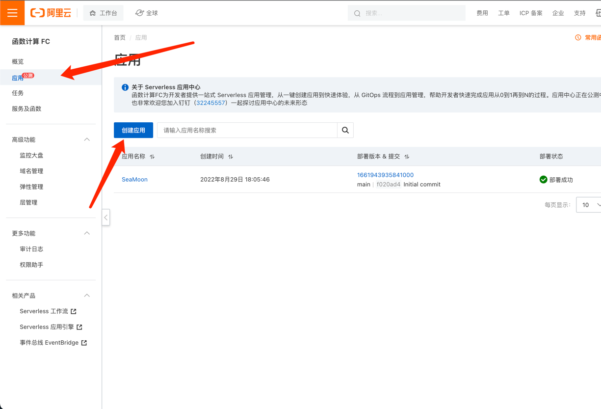
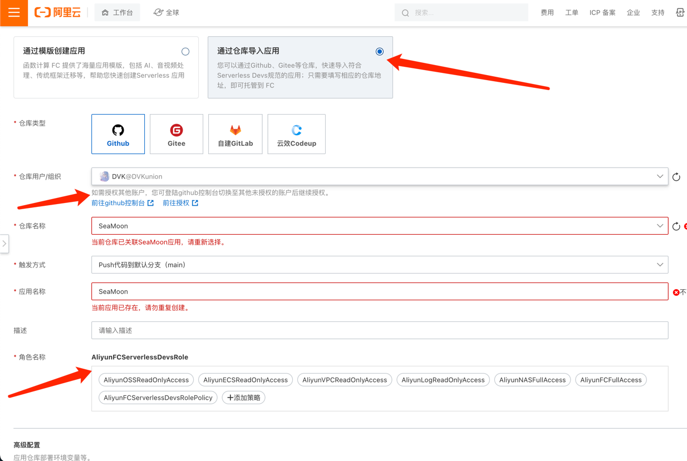
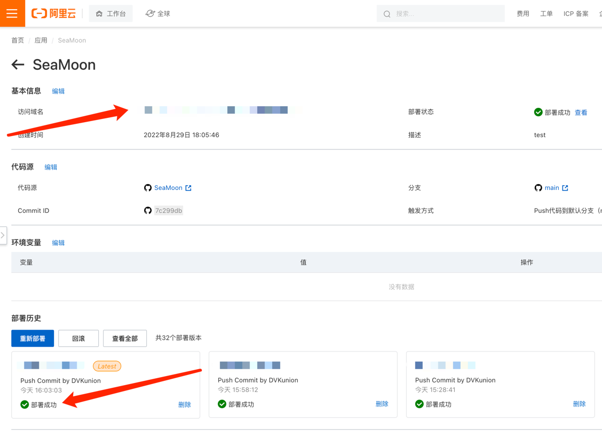

# 部署

## 阿里云

1. fork 该仓库到您自己的 github 账户下
2. 进入阿里云控制台，点击应用 -> 创建应用

3. 选择 `通过仓库导入应用` ， 授权Github账户后，选择fork好的仓库，如果您之前没有使用过阿里云，在角色权限处还需要进行一次授权。

4. 点击创建，等待服务部署成功，即可获取到代理地址

5. [开启客户端](https://github.com/DVKunion/SeaMoon/blob/main/docs/START.md), 尽情享用

